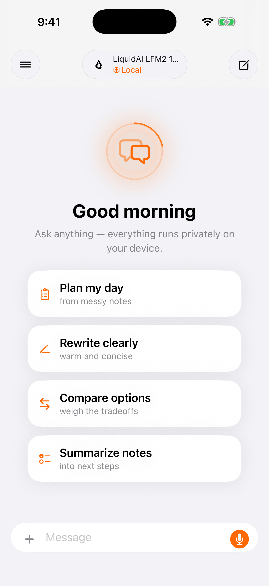
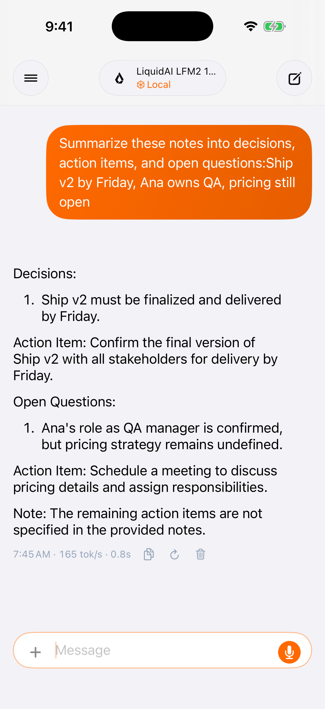
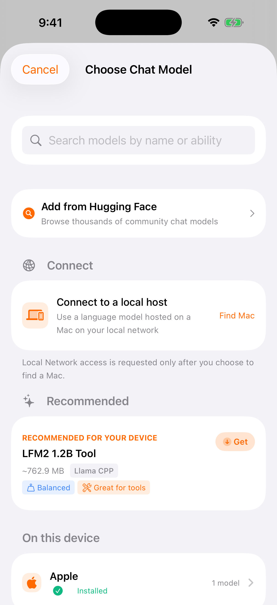
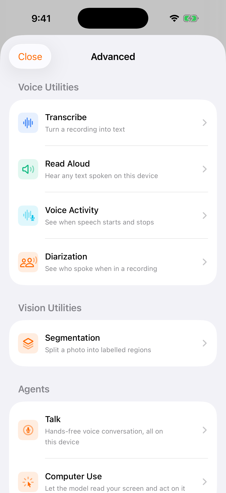
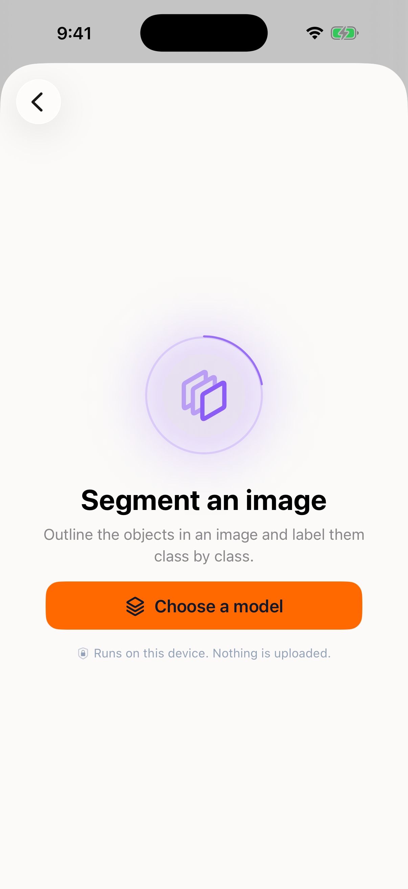
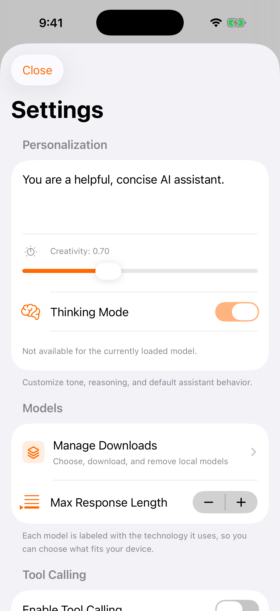

# RunAnywhere AI iOS and macOS example

A reference app for the [RunAnywhere Swift SDK](https://github.com/RunanywhereAI/runanywhere-sdks/blob/main/bindings/swift/README.md):
LLM chat, speech, vision, voice agents, RAG, benchmarks, and model management, running
on-device on iPhone, iPad, and Mac. It ships on the
[App Store](https://apps.apple.com/us/app/runanywhere/id6756506307).

## Screenshots

Captured on an iPhone 17 Pro simulator running LiquidAI LFM2 1.2B Tool, quantised Q4_K_M,
through the llama.cpp backend.

| | |
|---|---|
|  |  |
| Model loaded and ready. The header shows which one is active and that it is local. | An answer, with tokens per second and wall time under it. Nothing left the device. |
|  |  |
| The picker recommends a model for the device, and can pull any GGUF from Hugging Face. | Everything beyond chat lives here, grouped by what it does. |
|  |  |
| Segmentation outlines objects in a photo and labels them. | Settings covers the system prompt, sampling, tool calling, and local storage. |

The image files are in [`docs/screenshots/`](docs/screenshots).

## Requirements

| Item | Minimum |
|---|---|
| Xcode | 26+, with Swift 6.2 and iOS 17.5 simulator runtimes |
| Platforms | iOS 17.5, macOS 14.5 |
| Command line tools | Selected in Xcode, Settings, Locations |
| Disk | Several GB for SDK artifacts and models |
| Device | Apple Silicon recommended; MLX needs a physical device or native macOS |

## Setup

There is no monorepo checkout to build and no XCFramework to stage. SwiftPM downloads the
checksum-verified native archives during resolve.

```bash
git clone https://github.com/RunanywhereAI/runanywhere-ios.git
cd runanywhere-ios
swift package resolve
```

`Package.swift` declares one dependency, and the Xcode project mirrors it:

```swift
.package(
    url: "https://github.com/RunanywhereAI/runanywhere-swift.git",
    from: "0.20.19"
)
```

`runanywhere-swift` is a Swift-only SwiftPM distribution generated from the
`runanywhere-sdks` monorepo. Consume it rather than the monorepo: it is a few MB instead
of a few hundred, and it carries the generated proto sources that the monorepo no longer
commits. Its tags are bare semver with no `v` prefix, which is what `from:` needs. The
XCFramework binary targets still point at the checksum-verified release assets on
`runanywhere-sdks`.

The five products it publishes, all of which this app links:

| Product | Role |
|---|---|
| `RunAnywhere` | Core SDK, always required |
| `RunAnywhereLlamaCPP` | llama.cpp backend: LLM, VLM |
| `RunAnywhereONNX` | Sherpa-ONNX backend: STT, TTS, VAD |
| `RunAnywhereMLX` | Apple MLX backend, physical device or native macOS |
| `RunAnywhereNeuRT` | Apple Neural Engine backend |

Three files have to agree on the version: `Package.swift` (`from:`), the Xcode project's
package reference (`upToNextMajorVersion` from the same minimum), and `Package.resolved`,
which records the exact version and commit resolve selected. `Package.resolved` is
committed and CI fails if a fresh resolve leaves it dirty.

To take a newer SDK release within the same major, run `swift package update` and commit
the refreshed `Package.resolved`. To require a newer minimum, bump the version in
`Package.swift` and in the Xcode project's package reference, then resolve again. If
resolution misbehaves, use File, Packages, Reset Package Caches first.

## Build and run

Open `RunAnywhereAI.xcodeproj` and press ⌘R, or:

```bash
./scripts/build_and_run_ios_sample.sh simulator "iPhone 16 Pro"
./scripts/build_and_run_ios_sample.sh device
./scripts/build_and_run_ios_sample.sh mac
```

`./scripts/verify.sh` resolves the package and runs a full simulator `xcodebuild`, which is
the slow half of CI. `./scripts/smoke.sh` is the fast half: it greps the sources for SDK
call patterns and checks the Parakeet CTC catalog entry, without compiling.

Runtime logs:

```bash
log stream --predicate 'subsystem CONTAINS "com.runanywhere"' --info --debug
```

Most loggers use the `com.runanywhere.RunAnywhereAI` subsystem, a couple use plain
`com.runanywhere`, and the SDK logs under its own, so match on the prefix.

## Tests

Unit tests live in `RunAnywhereAIUnitTests/` and build into the `RunAnywhereAITests`
target; the XCUITest launch test lives in `RunAnywhereAIUITests/`. Both need a booted
simulator:

```bash
xcodebuild test \
  -project RunAnywhereAI.xcodeproj \
  -scheme RunAnywhereAI \
  -destination 'platform=iOS Simulator,name=iPhone 17 Pro' \
  -only-testing:RunAnywhereAITests
```

Drop `-only-testing:` to run the UI test as well.

## Continuous integration

`.github/workflows/ci.yml` runs on pushes and pull requests against `main`. It checks out a
clean clone on `macos-latest` (the macOS 26 arm64 image, the line carrying Xcode 26, which
`swift-tools-version: 6.2` requires), then:

1. resolves the SDK remotely, to prove no monorepo checkout is needed, and fails if the
   resolve left `Package.resolved` dirty (i.e. the committed pin was stale);
2. builds the `RunAnywhereAI` scheme for `generic/platform=iOS Simulator`, which pulls in
   the keyboard and Live Activity extensions;
3. runs `-only-testing:RunAnywhereAITests` on a booted simulator;
4. runs `./scripts/smoke.sh`.

Signing is off, since a simulator build needs no identity and hosted runners have no
`DEVELOPMENT_TEAM`.

## Features

Chat is the app. Everything else sits behind an Advanced hub, reached from the chat on iOS
and from the sidebar on macOS.

| Feature | Description | Platforms |
|---|---|---|
| Chat | Streaming LLM with thinking mode, tool calling, document attachments, and LoRA adapters | iOS, macOS |
| Speech to text | Batch, live, and hybrid transcription (Sherpa-ONNX, Whisper) | iOS, macOS |
| Text to speech | Neural Piper voices | iOS, macOS |
| Talk | Full STT, LLM, TTS voice agent with a Metal particle UI | iOS, macOS |
| Vision | Camera and photo-library image understanding, including a live mode | iOS, macOS |
| Diarization | Who spoke when in a recording | iOS |
| Segmentation | Labelled photo regions | iOS |
| Computer use | The model reads a screenshot and acts on it | iOS, macOS |
| Connect | Host a model on a Mac and use it from your other devices | Host: macOS. Client: iOS |
| Benchmarks | Deterministic LLM, STT, TTS, and VLM performance tests | iOS, macOS |
| Voice keyboard | Keyboard extension with a cross-process dictation flow | iOS |
| Model management | Download, load, storage, and deletion, plus Hugging Face import | iOS, macOS |

MLX-backed models run on physical iOS devices and native macOS. On the arm64 simulator
`MLX.register()` returns false, so the build validates packaging and startup but runs no
MLX inference and seeds no MLX catalog entries.

## Layout

`RunAnywhereAI/` holds the app: `App/` (entry point and platform shells), `Features/`,
`Core/` (design system, services, models), and `Helpers/`. `RunAnywhereKeyboard/` and
`RunAnywhereActivityExtension/` are the two extension targets. The app and the keyboard
deploy to iOS 17.5; the Live Activity extension needs iOS 26.2, so on older systems it
simply does not load.

Architecture is MVVM with Swift Observation, one `RunAnywhere.*` entry point per modality,
and centralized design tokens around brand orange `#FF6900`. `AGENTS.md` has the full
reference.

## Troubleshooting

| Symptom | Fix |
|---|---|
| Missing XCFramework errors | Reset package caches and rerun `swift package resolve` so SwiftPM re-downloads the release archives |
| Package resolution failures | Same: reset caches, resolve again |
| Sandbox or derived-data issues | Clean the build folder (⇧⌘K), delete DerivedData if it persists |
| MLX unavailable | Use a physical device or native macOS; MLX reports unavailable on the simulator |

## Links

| Resource | Link |
|---|---|
| Swift SDK | [bindings/swift](https://github.com/RunanywhereAI/runanywhere-sdks/blob/main/bindings/swift/README.md) |
| Android example | [runanywhere-android](https://github.com/RunanywhereAI/runanywhere-android) |
| Web example | [runanywhere-web](https://github.com/RunanywhereAI/runanywhere-web) |
| Electron example | [runanywhere-electron](https://github.com/RunanywhereAI/runanywhere-electron) |
| React Native example | [bindings/react-native/example](https://github.com/RunanywhereAI/runanywhere-sdks/blob/main/bindings/react-native/example/README.md) |
| Flutter example | [bindings/flutter/example](https://github.com/RunanywhereAI/runanywhere-sdks/blob/main/bindings/flutter/example/README.md) |
| App Store | [RunAnywhere](https://apps.apple.com/us/app/runanywhere/id6756506307) |
| Discord | [discord.gg/N359FBbDVd](https://discord.gg/N359FBbDVd) |
| Issues | [GitHub Issues](https://github.com/RunanywhereAI/runanywhere-ios/issues) |
| Email | founders@runanywhere.ai |

## License

RunAnywhere License, Apache 2.0 based with additional commercial-use terms. See
[LICENSE](LICENSE).
